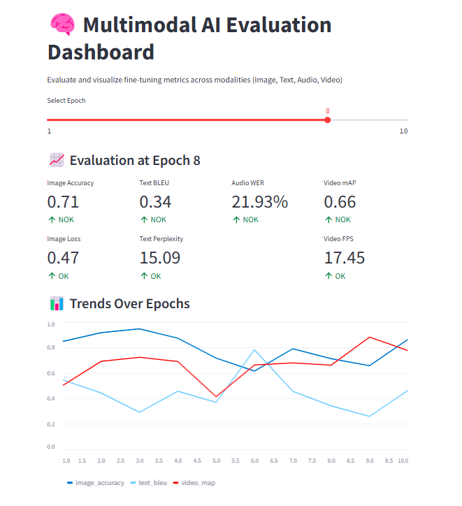

# 🧠 Multimodal AI Evaluation Dashboard Streamlit

This is a Streamlit app to visualize and evaluate training and fine-tuning metrics for multimodal AI systems (Image, Text, Audio, Video).
Below is an example of the app deployed on a Gradio public link:



## 📦 Features

- Epoch slider to monitor progress
- Metric evaluation: Accuracy, BLEU, WER, mAP, etc.
- OK/NOK status labels for quick health check
- Line charts to show performance trends

## 🚀 How to Run

1. Install dependencies:
```bash
pip install streamlit pandas numpy
```

2. Run the app:
```bash
streamlit run app.py
```

3. Open the browser at the displayed localhost URL.

## 📊 Metrics

| Modality | Metric | OK Range | NOK Range |
|----------|--------|----------|-----------|
| Image    | Accuracy > 0.85 | OK | < 0.7 |
| Text     | BLEU > 0.7 | OK | < 0.3 |
| Audio    | WER < 10% | OK | > 30% |
| Video    | mAP > 0.75, FPS > 15 | OK | < 0.5, < 10 |

## 🛠 Customize

Replace the `load_logs()` function with real log ingestion logic from your training framework (CSV, JSON, TensorBoard logs, etc.)

## 📂 Structure

```
multimodal_eval_dashboard/
├── app.py
└── README.md
```
